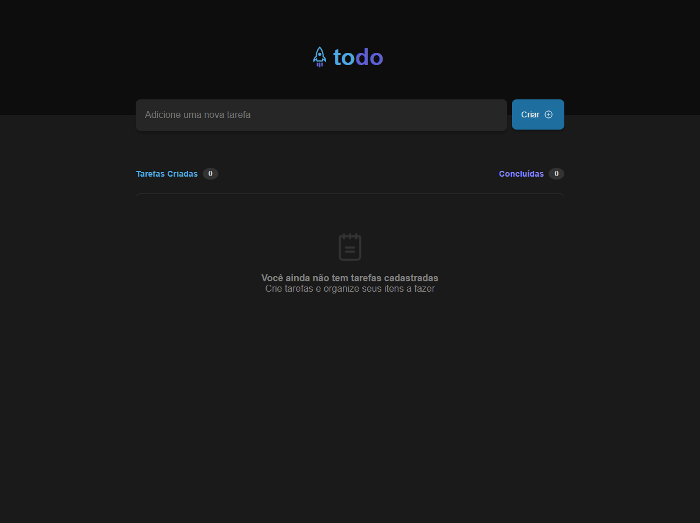
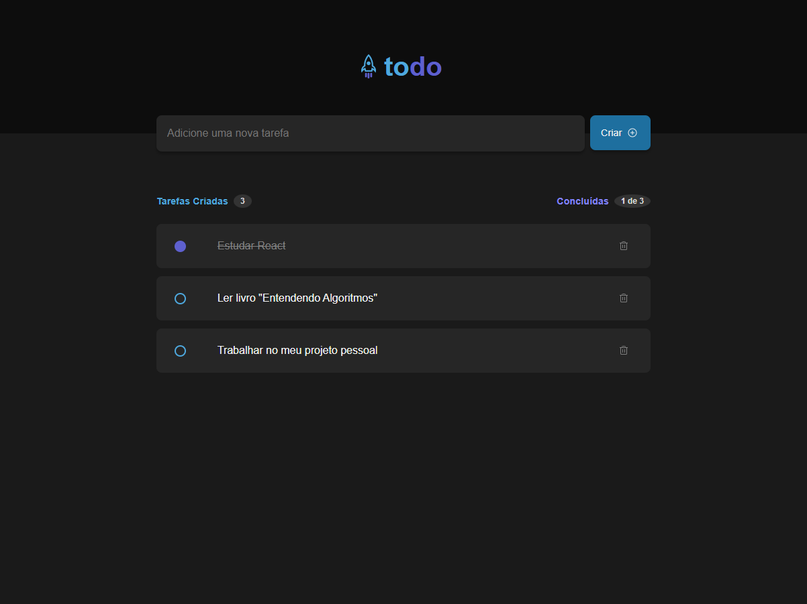
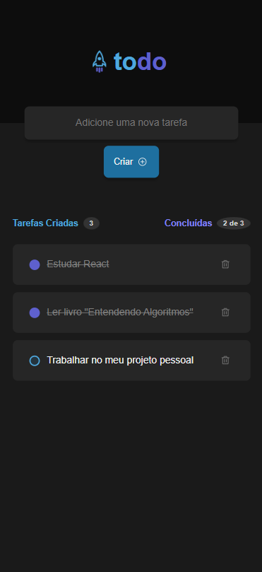

# ToDo List

This was the practical challenge developed in Level 01 of Rocketseat's React course.

## Table of contents

- [Overview](#overview)
  - [Screenshots](#screenshots)
- [How to Run the Project](#how-to-run-the-project)
- [My process](#my-process)
  - [Developed with](#developed-with)
- [Author](#author)

## Overview

This project is a to-do list where you can add, remove, and mark tasks as completed.

### Screenshots

#### Desktop design


#### Active desktop design


#### Mobile design


## How to Run the Project

To run the project locally, follow these steps:

1. Clone the repository:
   ```bash
   git clone "https://github.com/itsdavss/todo-list"

2. Navigate to the project folder:
   ```bash
   cd todo-list

3. Install the dependencies:
   ```bash
   npm install

4. Start the development server:
   ```bash
   npm run dev

## My process

During the development of this project, I practiced important React concepts such as state, state immutability, lists and keys in ReactJS, props, and componentization. Additionally, I deepened my understanding of array manipulation methods like map and filter. I also had the opportunity to practice TypeScript by implementing static typing in my code.

### Developed with

- TypeScript 
- React

## Author

- GitHub - [itsdavss](https://github.com/itsdavss)
- My portfolio - [Davi Oliveira](https://itsdavss.github.io/portfolio-davi/)